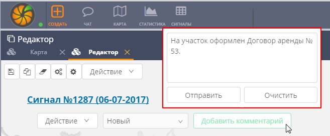
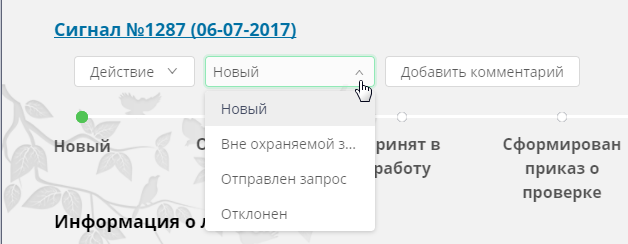
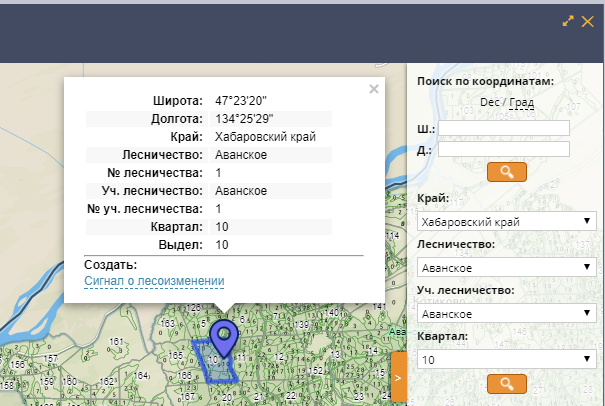

================================================
Описание конфигурации «Кедр.Диспетчерский центр»
================================================

Назначение системы
==================
 
Конфигурация «Кедр. Диспетчерский центр» на базисе платформы автоматизации «CITORUS» (далее – *система «Кедр»*) – полуавтоматическая корпоративная информационная программа со специализированным доступом через информационно-телекоммуникационную сеть «Интернет», созданная с целью защиты государственного лесного фонда Российской Федерации путем непрерывного оперативного мониторинга, выявления и пресечения лесонарушений.

Система «Кедр» осуществляет интеграцию на уровне данных и API-запросов между модулями на базе веб-ГИС (далее – *веб-приложение*) и
специализированными приложениями (далее – *мобильное приложение*).

Для обеспечения принятия оптимальных решений система «Кедр» интегрирована с отраслевыми, общероссийскими и международными системами
и источниками данных, такими как: Единой государственной автоматизированной информационной системой (ЕГАИС), Системой «ИСДМ-Рослесхоз», системами мониторинга пожаров SFMS, FIRMS и другими.

Авторизация
===========

Работа с системой «Кедр» осуществляется с помощью
программы-браузера. Для доступа к системе необходимо наличие подключения
к сети Интернет.

Чтобы выполнить вход в систему, следует открыть браузер и ввести в
адресную строку ссылку на требуемую инсталляцию системы. Откроется
страница авторизации (рис. 1).

В полях **Логин** и **Пароль** следует указать соответствующие данные
учетной записи и нажать на кнопку **Войти в систему**.

           
           Рисунок 1 – Страница авторизации

Основные данные конфигурации
============================
 
Пользователями системы «Кедр» являются
диспетчеры уполномоченных органов исполнительной власти –
департаментов/комитетов/управлений лесного хозяйства регионов. Основной
задачей, которую решают пользователи при работе с системой, является
обработка сигналов о различных изменениях в лесных массивах, в том числе
– о незаконных вырубках лесов.

Система агрегирует сигналы о лесоизменениях из различных источников.
Так, на регулярной основе в систему поступают и обрабатываются в
автоматическом режиме данные дистанционного зондирования Земли и
сообщения от населения (через мобильное приложение и виджеты). В будущем
в систему будут также поступать данные фото- и видеосъемки с беспилотных
летательных аппаратов (БПЛА) (подробнее см. в разделе `Источники данных о сигналах`_).

Обработка сигналов о лесоизменениях включает следующие этапы:

1. Первичная обработка сигнала – на этом этапе диспетчерам необходимо
   классифицировать полученный сигнал о лесоизменении. Решение
   принимается на основании следующих обновляемых в системе данных:

   -  Договора аренды лесных территорий,
   -  Декларации на коммерческие законные лесные рубки,
   -  Таксации,
   -  Данные о лесных пожарах,
   -  Данные по природоохранным территориям,
   -  Космоснимки среднего, высокого и сверхвысокого разрешения.

2. Инициация выездной проверки территории.
3. Отслеживание хода проверки.
4. Формирование нормативных документов.
5. Публикация в системе собранных материалов проверки.
6. Передача документов в архив.

           
           Рисунок 2 – Представление данных

Сигналы и данные, предназначенные для классификации сигналов,
представлены в системе следующими способами (рис. 2):

1. Как объекты в иерархическом дереве элементов системы. Каждый объект
   (например, сигнал о лесоизмении) имеет визуальное представление, то
   есть при выборе данного объекта открывается карточка с информацией,
   которую содержит данный объект.

2. В виде отдельных слоев на карте (см. раздел `Просмотр отраслевой геокодированной информации`_).

Сигналы о лесоизменениях
------------------------

Сигналы о лесоизменениях являются основной сущностью системы. Они
создаются путем дешифрации космоснимков среднего разрешения, поступающих
в систему со спутников серии Landsat, а также на основе данных,
поступающих в систему от населения посредством мобильного приложения и
виджетов (подробнее см. в разделе `Источники данных о сигналах`_).

Каждому сигналу автоматически присваивается приоритет на основании
различных факторов. Таковыми могут, например, являться: нахождение
участка лесоизменения в области произрастания ценных пород деревьев и
близость лесовозных дорог к участку лесоизменения (подробнее см. в
разделе «Машинная обработка данных»).

Сигналы составляют отдельный слой на карте. Как правило, данный слой
включен в системе по умолчанию. Слой представляет собой совокупность
векторных точек, каждая из которых соответствует определенному сигналу о
лесоизменении. Точки устанавливаются на карте согласно геоданным,
которые передаются в систему в составе данных о лесоизменениях.

Обработка сигналов диспетчерами осуществляется согласно определенным
сценариям (см. раздел `Сценарии обработки`_). При запуске какого-либо
сценария система устанавливает на карте фокус на точке сигнала, который
имеет наивысший приоритет в рамках данного сценария и который следует
обработать первым.

Обработка сигнала осуществляется с помощью карточки данного сигнала (см.
раздел `Обработка сигнала о лесоизменении`_). Переход к карточке сигнала
осуществляется с помощью всплывающей подсказки, которая отображается при
нажатии на точку сигнала на карте. После обработки сигнала с наивысшим
приоритетом диспетчер переходит к обработке сигнала, который является
следующим в очереди обработки (на основании установленных приоритетов).

Карточки новых и обработанных (архивных) сигналов автоматически
распределяются по соответствующим контейнерам в дереве элементов
системы. При необходимости (например, при обработке сигналов вне
сценариев) диспетчер может выполнять поиск требуемых сигналов в данных
контейнерах (см. раздел `Табличный поиск`_) и осуществлять работу с
карточками данных сигналов.

Договоры аренды лесных территорий
---------------------------------

В систему «Кедр» регулярно
загружаются Договоры аренды лесных участков. Данные договоры содержатся
в контейнере **Договора аренды** дерева объектов системы, а также
представлены как отдельные слои на карте.

При включении данных слоев участки, на которые заключены действующие
договора аренды, подсвечиваются на карте голубым цветом (рис. 3). При
наведении курсора мыши на такой участок появляется всплывающая
подсказка, в которой указано наименование организации-арендатора и
площадь арендуемой территории. Данная информация позволяет диспетчеру
сделать выводы о происхождении лесоизменения.

           
           Рисунок 3 – Слой договоров аренды

Декларации на коммерческие законные рубки
-----------------------------------------
 
В систему «Кедр» регулярно загружаются Лесные декларации, оформленные лесопользователями
той области/областей, в которых используется система. Данные декларации
содержатся в контейнере **Лесные декларации** дерева объектов системы и
представлены одноименной группой слоев в меню управления слоями (см.
раздел `Просмотр отраслевой геокодированной информации`_).

При включении слоев данной группы участки, на которые оформлены Лесные
декларации, подсвечиваются на карте зеленым цветом (рис. 4). При щелчке
мышью по такому участку отображается всплывающая подсказка, в которой
представлен номер соответствующей декларации и его территориальное
описание. Данная информация позволяет диспетчеру сделать выводы о
происхождении лесоизменения на этом участке.

           
           Рисунок 4 – Слой Лесных деклараций

Лесоустроительная информация (таксации)
---------------------------------------

*Таксация* – это документ,
который описывает породный состав деревьев какого-либо выдела и содержит
таксационные показатели данного выдела: целевое назначение лесов,
площадь, категорию защитных лесов и т.д. Таксации расположены в
контейнере **Таксационные показатели** в дереве объектов системы.

Таксации позволяют диспетчерам определить вероятность незаконной вырубки
лесного массива на требуемых участках. Так, если в таксации указано, что
на участке сигнала произрастают деревья ценных пород, то это значит, что
с большой долей вероятности на данном участке действительно
осуществляется незаконная вырубка лесного массива. Сигналы с участков,
на которых произрастают ценные породы деревьев, принимаются диспетчерами
в обработку в первую очередь.

Данные о пожарах
----------------

Сигналы, которые создаются в системе по
результатам дешифрации спутниковых снимков Landsat, сообщают о
лесоизменениях в широком смысле. При этом причиной лесоизменения может
являться как незаконная вырубка лесного массива, так и лесной пожар.
Поэтому при обработке сигнала, созданного на основе данных
космомониторинга, диспетчеру необходимо убедиться в том, что данный
сигнал не является сигналом о лесном пожаре.

Данные о лесных пожарах поступают в систему автоматически из следующих
источников:

-  со спутников «Aqua» и «Terra» ведомства NASA,
-  со спутника «Suomi NPP» и других.

Данные с каждого спутника/сервиса загружаются в отдельные слои на карте,
которые сгруппированы в меню управления слоями, в папке **Данные
мониторинга > Пожары** (см. раздел `Просмотр отраслевой геокодированной информации`_). Эти слои содержат термоточки, которые с большой долей вероятности свидетельствуют о наличии очага природного пожара на
указанной территории.

При выборе какого-либо слоя лесных пожаров в нижней части карты
отображается временная шкала (таймлайн), с помощью которой можно
отфильтровать термоточки по дате их обнаружения (подробнее см. в разделе
`Просмотр истории объектов с помощью таймлайна`_).

Данные по природоохранным территориям
-------------------------------------
 
В отдельные слои карты,
расположенные в группах **Леса ограниченного пользования** и **Ценные
леса** (см. раздел `Просмотр отраслевой геокодированной информации`_),
загружаются данные о территориях, на которых запрещается осуществление
деятельности, несовместимой с их целевым назначением и полезными
функциями:

-  Особо охраняемые природные территории России (ООПТ),
-  Орехово-промысловые зоны (ОПЗ),
-  Защитные леса,
-  Зоны воспроизводства,
-  Территория традиционного природопользования (ТТП),
-  Места произрастания редких растений,
-  Кедровые леса,
-  Мультипородные леса,
-  Малонарушенные лесные массивы,
-  Малонарушенные лесные территории.

Если точка сигнала на карте расположена на одной из перечисленных
территорий, то такой сигнал принимается в обработку в первую очередь.

Космоснимки среднего разрешения
-------------------------------

Основным источником данных об
изменениях лесного массива являются космоснимки среднего разрешения со
спутников серии Landsat. По результатам дешифрации данных снимков в слои
карты загружаются (рис. 5):

-  В слой **Лесоизменения** – векторные точки сигналов о лесоизменениях
   (см. разделы `Сигналы о лесоизменениях`_ и `Просмотр и поиск информации на карте`_).
-  В слой **Космический мониторинг** – растровые точки лесоизменений.

Растровые точки слоя **Космический мониторинг** имеют следующую цветовую
градацию:

-  Красным цветом помечаются лесоизменения последнего космомониторинга
   высокой вероятности.
-  Коричневым – лесоизменения последнего космомониторинга низкой
   вероятности.
-  Голубым – лесоизменения до последнего космомониторинга высокой
   вероятности.
-  Бирюзовым – лесоизменения до последнего космомониторинга низкой
   вероятности.

При включении слоев **Лесоизменения** и **Космический мониторинг** в
нижней части карты отображаются таймлайны, с помощью которых точки
каждого слоя можно отфильтровать по дате (подробнее см. в разделе
`Просмотр истории объектов с помощью таймлайна`_).

Слои **Лесоизменения** и **Космический мониторинг** дополняют друг друга
и способствуют лучшему визуальному восприятию информации о
лесоизменениях, поступившей со спутников.

.. figure:: _static/kosmosnimki_sred_razr_1.png
           :scale: 100 %
           :align: center        
           
           Рисунок 5 – Слои **Лесоизменения** и **Космический мониторинг**

Космоснимки высокого разрешения
-------------------------------

В отдельные слои карты,
расположенные в группе **Космические снимки высокого разрешения**,
загружаются:

1. Композиты различных сервисов (Google, Ersi и других), которые созданы
   из серии снимков высокого и сверхвысокого разрешения.
2. Снимки высокого разрешения, которые при необходимости запрашиваются
   диспетчерами вручную с сервиса Sentinel (подробнее см. в разделе
   `Запрос снимков высокого разрешения`_).

Снимки Sentinel помогают определить вероятность незаконной вырубки на
требуемом участке лесного массива. Слой **Sentinel** имеет временную
шкалу, при передвижении бегунка которой диспетчер может отследить
изменения лесного массива на обозначенном участке (при их наличии) и
принять решение об отклонении/запуске сигнала о лесоизменении в работу.

Источники данных о сигналах
===========================

Система оперативного мониторинга
лесоизменений «Кедр» позволяет агрегировать сигналы о лесоизменениях из
различных источников. В настоящее время в систему поступают и
обрабатываются данные о лесоизменениях со спутников серии Landsat и от
населения посредством мобильного приложения и виджетов. Не зависимо от
того, из какого источника поступила информация об изменении лесного
массива, на входе в систему создается унифицированный «Сигнал о
лесоизменении».

Данные спутникового мониторинга о лесоизменениях
-------------------------------------------------

Основным источником данных о лесоизменениях являются снимки среднего разрешения,
которые поступают в систему со спутников серии Landsat. Сигналы
создаются путем дешифрации данных снимков.

Видеомониторинг
---------------

В настоящее время ведется работа над проектом по
использованию беспилотных летательных аппаратов (БПЛА), основной целью
которых будет являться видеомониторинг участков, на которых, согласно
космомониторингу, произошли изменения лесного массива. На основании
данных видеомониторинга БПЛА будет осуществляться определение характера
данных изменений.

Мобильное приложение
--------------------

Одним из источников данных о лесоизменениях
является мобильное приложение «Сохрани лес». Данное приложение является
бесплатным и работает на платформах Windows Phone, Apple iOS и Android.

Приложение позволяет любому пользователю мобильного устройства отправить
сигнал о лесоизменении в систему «Кедр» и отслеживать статус его
обработки диспетчерами. Для передачи сигнала может быть оформлена
текстовая заявка с указанием координат лесоизменения или совершен
телефонный звонок. Сигнал может содержать информацию о следующих
лесоизменениях: лесной пожар, незаконная рубка или незаконная свалка
мусора.

Слои, расположенные на карте приложения, позволяют отслеживать:

-  заявления других пользователей,
-  автоматически распознанные по космосъемке точки лесоизменений,
-  автоматически распознанные по космосъемке точки пожаров.

Кроме того, карта содержит следующие слои:

-  Территории, которые приписаны к конкретным лесным инспекторам.
-  Территории лесничеств.
-  Космические снимки спутников серии Landsat с разрешением 15 м/пикс.

Виджеты
-------

Для сбора сигналов от населения также используются виджеты
– веб-формы, которые встраиваются в различные веб-ресурсы (как правило,
природоохранной тематики) и позволяют передавать заявления о
лесоизменениях в систему «Кедр». Примером такого виджета является кнопка
**Сообщить о нарушении** на сайте http://savetaiga.ru, при нажатии на
которую открывается веб-форма, представленная на рисунке 6.

Данная форма позволяет:

-  Отправить сигнал о лесоизменении диспетчерам. Координаты обнаружения
   лесоизменения можно указать вручную или отметить на карте. Каждому
   отправленному сигналу присваивается уникальный номер.
-  Отслеживать статус обработки сигнала по присвоенному ему номеру.

           
           Рисунок 6 – Веб-форма

Сценарии обработки
==================

Запуск сценариев из главного меню
---------------------------------

При обработке сигналов о лесоизменениях диспетчеру рекомендуется придерживаться определенных
сценариев. В связи с этим при входе в систему на экране отображается
диалоговое окно, представленное на рисунке 7.

           
           Рисунок 7 – Диалоговое окно

При нажатии в данном окне на кнопку **ОК** в главном меню автоматически
разворачивается подменю со списком сценариев обработки сигналов (рис.
8). Диспетчеру необходимо выбрать в данном подменю сценарий, который
подходит для решения его текущих задач, и следовать этому сценарию.

           
           Рисунок 8 – Подменю сценариев

В подменю содержатся следующие сценарии:

-  **Сценарий 1 «Работа с сигналами общей очереди»** (см. раздел
   `Сценарии 1-3`_) – сценарий предназначен для работы с новыми сигналами о
   лесоизменениях. На первичную обработку таких сигналов отведено три
   часа.

-  **Сценарий 2 «Работа с сигналами с истекающими сроками»** (см. раздел
   `Сценарии 1-3`_) – в данный сценарий попадают сигналы о лесоизменениях,
   для обработки которых осталось менее 75% отведенного времени. Это
   могут быть как новые сигналы из сценария 1, так и сигналы, которые
   находятся на какой-либо стадии обработки.

-  **Сценарий 3 «Работа с просроченными сигналами»** (см. раздел
   `Сценарии 1-3`_) – данный сценарий имеет наивысший приоритет. В него
   попадают такие сигналы из сценария 1, по которым за отведенные три
   часа не было принято никакого решения.

-  `Сценарий 4 «Работа с сигналами вне лесного фонда»`_ – сценарий
   предназначен для работы с сигналами о лесоизменениях, которые
   поступают не из лесного фонда, то есть с каких-либо участков, которые
   не относятся к лесничествам.

-  `Сценарий 5 «Фильтрация сигналов по свойствам»`_ – сценарий предназначен
   для фильтрации сигналов, отображаемых на карте, по различным
   параметрам.

-  `Сценарий 6 «Внесение нового сигнала»`_ – сценарий предназначен для
   создания нового сигнала о лесоизменении вручную. Используется, когда
   сообщение о лесоизменении поступает в диспетчерский пункт по телефону
   или электронной почте.

При выборе какого-либо сценария подменю сценариев автоматически
закрывается. В процессе дальнейшей работы с системой его можно раскрыть
снова нажатием на кнопку **Сценарий** (рис. 9).

           
           Рисунок 9 – Кнопка **Сценарий**

Сценарии 1-3
------------

Навигация по сигналам на карте
^^^^^^^^^^^^^^^^^^^^^^^^^^^^^^

При запуске сценария 1, 2 или 3 фокус на карте автоматически
устанавливается на ярлыке сигнала о лесоизменении, который обладает
наивысшим приоритетом среди сигналов выбранного сценария. Приоритет
сигналам присваивается системой (см. раздел «Машинная обработка данных о
сигналах в системе»).

Над сигналом отображается всплывающее сообщение (рис. 10), в котором
содержится:

1. Основная информация о данном сигнале.
2. Ссылка для перехода в карточку сигнала.
3. Кнопки **Влево/Вправо**:

   -  кнопка **Влево** позволяет вернуться к предыдущему сигналу,
   -  кнопка **Вправо** предназначена для перехода к следующему сигналу
      в очереди обработки.

           
           Рисунок 10 – Всплывающее окно

Чтобы приступить к обработке сигнала, во всплывающем окне следует нажать
на ссылку **Просмотреть: Карточку объекта** (рис. 10, цифра 2). В новой
вкладке откроется карточка сигнала. Обработку данного сигнала следует
выполнить так, как это описано в разделе `Обработка сигнала о лесоизменении`_.

После того как обработка сигнала будет окончена, следует снова открыть
вкладку с картой и во всплывающем сообщении обработанного сигнала нажать
на кнопку **Вправо** (рис. 10, цифра 3). Фокус переместится на сигнал,
который, согласно приоритету, должен быть обработан следующим.

Обработка сигнала о лесоизменении
^^^^^^^^^^^^^^^^^^^^^^^^^^^^^^^^^

Обработка сигнала о лесоизменении осуществляется с помощью карточки данного сигнала.

Карточка сигнала содержит следующие элементы управления (рис. 11):

1. **Командные кнопки** (слева направо):

   -  **Действие** – при нажатии на данную кнопку открывается выпадающий
      список, с помощью пунктов которого диспетчер может выполнить
      основные действия по обработке сигнала:

      -  **Сформировать печатную форму** – при выборе данного пункта
         автоматически формируется документ *Запрос в
         лесничество.docx* (см. раздел `Первый этап`_).
      -  **Добавить вложение** – с помощью данного пункта осуществляется
         загрузка в карточку сигнала необходимых документов: ответа из
         лесничества, отчета о проведении выездной проверки и других.
         Прикрепленные документы отображаются в блоке карточки
         **Вложения** (рис. 13).
      -  **Показать на карте** – при выборе данного пункта в новой
         вкладке открывается карта, на которой отображается текущий
         сигнал о лесоизменении.
      -  **Экспорт карточки в GeoJSON** – с помощью данного пункта
         осуществляется скачивание данных о сигнале в машиночитаемом
         формате GeoJSON.
      -  **Акт № [номер акта] от [дата составления акта]** – данный
         пункт отображается, если к карточке сигнала приложен Акт о
         лесонарушении. Акты передаются в систему автоматически из
         мобильного приложения «Лесной инспектор» (см. раздел
         `Формирование акта о лесонарушении в мобильном приложении «Лесной инспектор»`_).

   -  Кнопка для смены статусов обработки сигнала.
   -  **Добавить комментарий** – данная кнопка используется, если на
      каком-либо этапе обработки сигнала диспетчеру необходимо добавить
      в карточку поясняющую или уточняющую информацию. Комментарии
      диспетчеров отображаются в блоке карточки **Лента событий** (рис.
      13).

2. **Таймер** – отсчитывает время, отведенное на завершение текущего
   статуса обработки сигнала.
3. **Таймлайн** – предназначен для визуального отображения текущего
   статуса обработки сигнала. При наведении курсора мыши на какой-либо
   статус отображается всплывающая подсказка, где перечислены основные
   действия, которые следует выполнить диспетчеру на данном этапе
   обработки сигнала.

           
           Рисунок 11 – Элементы управления карточки сигнала

Карточка сигнала содержит следующие блоки информации (рис. 12):

1. **Информация о лесоизменении** – в данном блоке содержится основная
   информация об изменении лесного массива: тип сигнала по источнику,
   тип инцидента, дата и время поступления и т.д. Данная информация
   доступна для редактирования.
2. **Геопривязка** – в данном блоке отображается карта, на которую
   нанесен маркер текущего сигнала о лесоизменении, и координаты данного
   сигнала.
3. **Лента событий** (рис. 13) – в данном блоке автоматически ведется
   запись о смене статусов обработки текущего сигнала, а также
   отображаются комментарии, добавленные диспетчерами при его обработке.
   В каждой записи указан логин пользователя, который внес в сигнал то
   или иное изменение.
4. **Вложения** – в данном блоке отображаются документы, которые
   загружаются диспетчером в карточку сигнала при его обработке.

           
           Рисунок 12 – Блоки **Информация о лесоизменении** и **Геопривязка**

           
           Рисунок 13 – Блоки **Лента событий** и **Вложения**

Обработка каждого сигнала включает семь этапов.

Первый этап
"""""""""""

Первый этап – оценка вероятности инцидента и отправка запроса в лесничество.

На данном этапе диспетчеру необходимо выполнить следующие действия:

1. С помощью слоев карты, которые соответствуют Таксационным показателям, Лесным декларациям, Договорам аренды и точкам пожаров следует убедиться, что текущий сигнал действительно является сигналом о незаконной вырубке лесного массива (см. разделы `Основные данные конфигурации`_ и `Просмотр отраслевой геокодированной информации`_). Для оценки вероятности инцидента можно также запросить снимки высокого разрешения (см. раздел `Запрос снимков высокого разрешения`_).
2. Если сигнал не подтверждается (например, если сигнал поступил с участка, на который оформлен действующий договор аренды), то его необходимо отклонить. Для этого следует:

   - Нажать на кнопку **Добавить комментарий** (рис. 14). Затем в открывшемся окне указать причину отклонения сигнала и нажать на кнопку **Отправить**. Комментарий отобразится в блоке **Лента событий** (рис. 13).
   - Нажать на кнопку смены статуса и в выпадающем списке выбрать статус **Отклонен** (рис. 15).

           
           Рисунок 14 – Добавление комментария

           
           Рисунок 15 – Смена статуса

3. Если есть основания для запуска сигнала в работу, то необходимо выполнить следующие действия:

   -  Отправить запрос в лесничество. Для этого следует нажать на кнопку **Действие** и в выпадающем списке выбрать пункт **Сформировать печатную форму** (рис. 16). В папку, которая выбрана в браузере для загрузки файлов, сохранится документ *Запрос в лесничество.docx*. В документ будет автоматически внесена информация из карточки сигнала. Недостающую информацию следует добавить вручную. Затем необходимо подписать документ и отправить его по факсу в лесничество.
   -  Прикрепить отправленный документ к карточке сигнала. Для этого следует нажать на кнопку **Действие** и в выпадающем списке выбрать пункт **Добавить вложение** (рис. 16). Откроется проводник Windows, в котором необходимо выбрать отправленный документ. После загрузки документ отобразится в блоке карточки **Вложения** (рис. 13).
   -  Если запрос выполнен не по факсу (например, посредством телефонного звонка), необходимо добавить комментарий. Для этого следует нажать на соответствующую кнопку **Добавить комментарий** (рис. 17). Затем в открывшемся окне указать параметры запроса информации (например, ФИО сотрудника, с которым осуществлялся телефонный разговор, время разговора и т.д.) и нажать на кнопку **Отправить**. Комментарий отобразится в блоке **Лента событий** (рис. 13).
   -  Изменить статус. Для этого следует нажать на кнопку смены статуса и в выпадающем списке выбрать статус **Отправлен запрос** (рис. 15).
      

           
           Рисунок 16 – Кнопка **Действие**

           
           Рисунок 17 – Добавление комментария

Второй этап
"""""""""""

Второй этап – получение ответа из лесничества и отклонение/принятие
сигнала в работу на основании данного ответа.

На получение ответа из лесничества отводится 12 часов (исключая
праздничные и выходные дни). Если ответ из лесничества не получен в
течение данного времени по факсу или электронной почте, то диспетчеру
необходимо получить его по телефону.

После того как ответ получен, необходимо выполнить следующие действия:

1. Прикрепить к карточке сигнала ответ из лесничества (при наличии его
   печатной формы). Для этого следует нажать на кнопку **Действие** и в
   выпадающем списке выбрать пункт **Добавить вложение** (рис. 18).
   Откроется проводник Windows, в котором необходимо выбрать полученный
   документ. После загрузки документ отобразится в блоке карточки
   **Вложения** (рис. 13).

           
           Рисунок 18 – Кнопка **Действие**

2. Если ответ получен не по форме (например, по телефону), то в карточку
   сигнала необходимо добавить комментарий. Для этого следует нажать на
   соответствующую кнопку **Добавить комментарий** (рис. 19). Затем в
   открывшемся окне указать ответ лесничества и нажать на кнопку
   **Отправить**. Комментарий отобразится в блоке **Лента событий**
   (рис. 13).

           
           Рисунок 19 – Добавление комментария

3. Если в ответе лесничества содержится информация о том, что
   лесоизменение является легальным, то следует изменить статус сигнала
   на **Отклонен**. Если лесоизменение является нелегальным, то следует
   изменить статус сигнала на **Принят в работу**. Для этого следует
   нажать на кнопку смены статуса и в выпадающем списке выбрать
   соответствующий статус (рис. 20).

           
           Рисунок 20 – Кнопка смены статуса

Третий этап
"""""""""""

Третий этап – формирование проекта приказа о проведении рейдового
мероприятия. Для выполнения необходимых действий на данном этапе
выделяется 2 часа. Время отображается в карточке на таймере.

Необходимые действия:

1. Сформировать проект приказа о проведении рейдового мероприятия.
2. Сформировать плановое (рейдовое) задание на проведение планового
   (рейдового) осмотра.
3. Изменить статус сигнала на **Сформирован приказ о проверке**. Для
   этого следует нажать на кнопку смены статуса и в выпадающем списке
   выбрать статус **Сформирован проект приказа** (рис. 21).
4. Оправить приказ на рассмотрение начальнику
   отдела/департамента/комитета лесного хозяйства.

           
           Рисунок 21 – Кнопка смены статуса

Четвертый этап
""""""""""""""

Четвертый этап – обработка приказа согласно резолюции начальника
отдела/департамента/комитета лесного хозяйства. При получении
отрицательной резолюции о проведении выездной проверки необходимо:

1. Добавить комментарий, в котором указать точную формулировку отказа.
   Для этого следует нажать на соответствующую кнопку **Добавить
   комментарий** (рис. 22). Затем в открывшемся окне указать текст
   резолюции и нажать на кнопку **Отправить**. Комментарий отобразится в
   блоке **Лента событий** (рис. 13).

           
           Рисунок 22 – Добавление комментария

2. Завершить обработку сигнала. Для этого следует нажать на кнопку смены
   статуса и в выпадающем списке выбрать статус **Отклонен** (рис. 23).

           
           Рисунок 23 – Кнопка смены статуса

При получении положительной резолюции о проведении выездной проверки
необходимо:

1. Внести данные в «Журнал учета» (вне системы).
2. Изменить статус сигнала на **Проводится проверка**. Для этого следует
   нажать на кнопку смены статуса и в выпадающем списке выбрать
   соответствующий статус (рис. 23).

При принятии решения о проведении выездной проверки на место
предполагаемого лесонарушения выезжает группа специалистов, в состав
которой, как правило, входят: государственный лесной инспектор, инженер
охраны и защиты леса и участковый лесничий. Если факт лесонарушения
подтверждается, то государственный лесной инспектор с помощью мобильного
приложения (см. раздел `Формирование акта о лесонарушении в мобильном приложении «Лесной инспектор»`_) формирует «Акт о лесонарушении», который автоматически передается в систему «Кедр» и прикрепляется к карточке
соответствующего сигнала.

Пятый этап
""""""""""

Пятый этап – внесение в систему результатов выездной
проверки.

Если в результате выездной проверки устанавливается факт незаконной
вырубки лесного массива, то составляется «Акт о лесонарушении» и данный
акт автоматически прикрепляется к карточке сигнала. Если на месте
проверки выявляется лесонарушение другого характера, то подготавливается
комплект документов, соответствующий данному нарушению (отчет о
проведении выездной проверки и другие). Данный комплект документов
передается в диспетчерский пункт доступным способом: в бумажном виде, по
факсу, по электронной почте.

Диспетчеру следует прикрепить данный комплект документов к карточке
сигнала вручную. Для этого следует нажать на кнопку **Действие** и в
выпадающем списке выбрать пункт **Добавить вложение** (рис. 24).
Откроется проводник Windows, в котором необходимо выбрать требуемые
документы. После загрузки данные документы отобразятся в блоке карточки
**Вложения** (рис. 13).

           
           Рисунок 24 – Кнопка **Действие**

Обязательными действиями диспетчера на данном этапе являются:

1. Заполнение «Журнала учета» (вне системы).
2. Изменение статуса сигнала на **Лесонарушение подтверждено** или
   **Лесонарушение не подтверждено** (статус устанавливается на
   основании результатов выездной проверки). Для смены статуса следует
   нажать на кнопку, представленную на рисунке 25, и в выпадающем списке
   выбрать соответствующий статус.

           
           Рисунок 25 – Кнопка смены статуса

При выборе статуса **Лесонарушение не подтверждено** обработка сигнала
автоматически завершается. Статус сигнала меняется на **Сдано в архив**
(рис. 26).

           
           Рисунок 26 – Обработка сигнала завершена

При выборе статуса **Лесонарушение подтверждено** сигналу
устанавливается соответствующий статус (рис. 27). После этого диспетчер
приступает к шестому этапу обработки сигнала.

           
           Рисунок 27 – Статус **Лесонарушение подтверждено**

Шестой этап
"""""""""""

Шестой этап – подготовка документов об
административном нарушении и возбуждении уголовного дела.

На данном этапе диспетчеру следует выполнить следующие действия:

1. Составить протокол об административном правонарушении в соответствии
   со статьей 28.2 КоАП РФ (вне системы).
2. Подготовить постановление о прекращении дела об административном
   правонарушении в соответствии со статьей 28.7 КоАП РФ (вне системы).
3. Подготовить и направить в надзорные и/или правоохранительные органы
   заявление о возбуждении уголовного дела в соответствии со статьей 260
   УК РФ (вне системы).
4. Изменить статус сигнала на **Передано в МВД**. Для этого следует
   нажать на кнопку смены статуса и в выпадающем списке выбрать
   соответствующий статус (рис. 28).

           
           Рисунок 28 – Кнопка смены статуса

Седьмой этап
""""""""""""

Седьмой этап – внесение в систему резолюции МВД и
завершение обработки сигнала.

На данном этапе диспетчеру следует выполнить следующие действия:

1. Прикрепить к карточке сигнала ответ из МВД. Для этого следует нажать
   на кнопку **Действие** и в выпадающем списке выбрать пункт **Добавить
   вложение** (рис. 24). Откроется проводник Windows, в котором
   необходимо выбрать требуемые документы. После загрузки данные
   документы отобразятся в блоке карточки **Вложения** (рис. 13).

           
           Рисунок 29 – Кнопка **Действие**

2. Добавить комментарий. Для этого следует нажать на соответствующую
   кнопку **Добавить комментарий** (рис. 30). Затем в открывшемся окне
   указать текст резолюции МВД и нажать на кнопку **Отправить**.
   Комментарий отобразится в блоке **Лента событий** (рис. 13).

           
           Рисунок 30 – Добавление комментария

3. Заполнить «Журнал учета» (вне системы).
4. Изменить статус сигнала на **Лесонарушение обработано**. Для этого
   следует нажать на кнопку смены статуса и в выпадающем списке выбрать
   соответствующий статус (рис. 31).

           
           Рисунок 31 – Кнопка смены статуса

Статус сигнала изменится на **Сдано в архив** (рис. 32).

           
           Рисунок 32 – Обработка сигнала завершена

Запрос снимков высокого разрешения
^^^^^^^^^^^^^^^^^^^^^^^^^^^^^^^^^^

.. note:: запрос снимков высокого разрешения доступен только при работе в системе «Кедр», разработанной на базе платформы «CITORUS» версии 2014 года (см. раздел `Система «Кедр» на версиях платформы 2014 и 2017 года`_).

Одним из способов, с помощью
которого можно установить характер лесоизменения на требуемом участке,
является изучение космоснимков высокого разрешения. Снимки загружаются в
систему из внешнего репозитория по запросу пользователя.

По умолчанию в систему загружаются все имеющиеся снимки указанного
участка за все временные периоды. Данные снимки накладываются друг на
друга. Благодаря этому, передвигая на карте бегунок временной шкалы,
можно отследить изменения, которые происходили с лесным массивом на
требуемом участке за последнее время.

Запрошенные снимки сохраняются в слое **Космические снимки высокого
разрешения > Sentinel**. Перед началом работы данный слой необходимо
включить в меню управления слоями (см. раздел `Просмотр отраслевой геокодированной информации`_).

Для того чтобы запросить снимки, следует щелкнуть мышью по требуемому
участку карты и во всплывающем окне нажать на иконку **Снимок высокого
разрешения** (рис. 33).

           
           Рисунок 33 – Всплывающее окно

Система отправит запрос на внешний сервис. Сообщение об этом отобразится
в диалоговом окне, представленном на рисунке 34. В данном окне следует
нажать на кнопку **ОК**.

           
           Рисунок 34 – Диалоговое окно

Через некоторое время на панели главного меню отобразится иконка
|image0| (рис. 35), указывающая на то, что запрошенные снимки поступили
в систему. Требуется нажать на данную иконку.

           
           Рисунок 35 – Снимки поступили в систему

Затем в отобразившемся диалоговом окне, представленном на рисунке 36,
следует нажать на кнопку **ОК**.

           
           Рисунок 36 – Диалоговое окно

В новой вкладке автоматически откроется карта. На участке, по которому
были запрошены снимки, отобразится иконка |image1| (рис. 37). Чтобы
просмотреть снимки, следует нажать на данную иконку и во всплывающем
окне щелкнуть по ссылке **Показать снимки**.

           
           Рисунок 37 – Инструменты просмотра снимков

На карте отобразятся запрошенные снимки (рис. 38). Под снимками
отобразится временная шкала. Для того чтобы отследить изменения лесного
массива на снимках, следует перемещать бегунок шкалы влево/вправо.

           
           Рисунок 38 – Снимки высокого разрешения

Если требуется отключить отображение снимков, во всплывающем окне
следует щелкнуть по ссылке **Убрать снимки**.

Формирование акта о лесонарушении в мобильном приложении «Лесной инспектор»
^^^^^^^^^^^^^^^^^^^^^^^^^^^^^^^^^^^^^^^^^^^^^^^^^^^^^^^^^^^^^^^^^^^^^^^^^^^

Если на четвертом этапе обработки сигнала (см. раздел `Четвертый этап`_)
принимается решение об организации выездной проверки данного сигнала, то
на указанный участок отправляется выездная группа, в состав которой, как
правило, входят: государственный лесной инспектор, инженер охраны и
защиты леса и участковый лесничий. Задачей выездной группы является
установка/отклонение факта лесонарушения.

Если факт лесонарушения подтверждается, то на его месте с помощью
`мобильного приложения «Лесной
инспектор» <http://docs.nextgis.ru/docs_forestinspector/source/inspector.html>`_
составляется «Акт о лесонарушении». После подписания акта данный
документ автоматически передается в систему «Кедр», и на его основе в
системе формируется объект **Акт № [номер акта] от [дата составления
акта]**. Ссылка на данный объект прикрепляется к карточке
соответствующего сигнала. Чтобы открыть карточку этого объекта, в
карточке сигнала следует нажать на кнопку **Действие** и в выпадающем
списке выбрать пункт **Акт № [номер акта] от [дата составления акта]**
(рис. 39).

           
           Рисунок 39 – Переход в карточку акта

Из акта, составленного с помощью мобильного приложения, в карточку акта
передаются следующие блоки информации:

+---------------------------+--------------------------------------------------------------------------------+
| **Название**              | **Описание**                                                                   |
+===========================+================================================================================+
| Системная                 | Номер и дата составления акта.                                                 |
+---------------------------+--------------------------------------------------------------------------------+
| Информация об акте        | Основная информация об акте:                                                   |
|                           |                                                                                |
|                           | -  Номер лесонарушения.                                                        |
|                           | -  Номер акта.                                                                 |
|                           | -  Дата, время и место составления акта.                                       |
|                           | -  ФИО и удостоверение лесного инспектора, составившего акт.                   |
|                           | -  Нормативный акт, на основании которого составлен «Акт о лесонарушении».     |
+---------------------------+--------------------------------------------------------------------------------+
| Вид лесонарушения         | Вид обнаруженного лесонарушения:                                               |
|                           |                                                                                |
|                           | -  Мусор в лесу,                                                               |
|                           | -  Незаконная рубка леса,                                                      |
|                           | -  Лесной пожар,                                                               |
|                           | -  Прочее.                                                                     |
+---------------------------+--------------------------------------------------------------------------------+
| Локация лесонарушения;    | Информация о территориальном расположении участка, на котором было совершено   |
| Квартал и выдел и         | лесонарушение, и категория защитности лесов, расположенных на этом участке.    |
| деляна	                | Данные рассчитываются автоматически на основе координат лесонарушения,         |
|                           | указанных при составлении акта в приложении «Лесной инспектор».                |
+---------------------------+--------------------------------------------------------------------------------+
| Информация об обнаружении | В этом разделе представлены:                                                   |
|                           |                                                                                |
|                           | -  данные о составе выездной группы,                                           |
|                           | -  точный/предположительный временной период совершения лесонарушения,         |
|                           | -  ФИО и реквизиты лесонарушителя.                                             |
+---------------------------+--------------------------------------------------------------------------------+
| Общий ущерб               | Общая сумма ущерба рассчитывается системой автоматически на основе данных      |
|                           | таблицы, представленной в блоке информации **Незаконная рубка** (см. ниже).    |
+---------------------------+--------------------------------------------------------------------------------+
| Незаконная рубка          | В данном разделе автоматически формируется таблица, в которой представлены     |
|                           | основные данные о вырубленных породах и сумма ущерба по каждой из них.         |
|                           | Таблица формируется и рассчитывается на основании данных, указанных в          |
|                           | «Ведомости пересчета» (является частью «Акта о лесонарушении»): номер выдела,  |
|                           | категория хлыстов, разряд высот, диаметр пней, порода вырубленных деревьев.    |
+---------------------------+--------------------------------------------------------------------------------+
| Прочие лесонарушения      | В таблице, расположенной в данном разделе, указывается площадь, единицы        |
|                           | измерения и сумма ущерба (в рублях) нарушений, которые относятся к виду        |
|                           | **Прочее** (см. выше описание блока **Вид лесонарушения**).                    |
+---------------------------+--------------------------------------------------------------------------------+
| Продукция описание        | В таблицу, расположенную в данном разделе, вносится информация из «Ведомости   |
|                           | о виде и количестве продукции, подлежащей изъятию», которая является частью    |
|                           | «Акта о лесонарушении».                                                        |
+---------------------------+--------------------------------------------------------------------------------+
| От прочих лесонарушений   | В данном разделе отображается информация об ущербе от нарушений, сопутствующих |
|                           | незаконной рубке. Например: повреждение редких видов растений, уничтожение     |
|                           | муравейников и др.                                                             |
+---------------------------+--------------------------------------------------------------------------------+
| Описание орудий           | В данном блоке представлена следующая информация:                              |
| незаконной рубки          |                                                                                |
|                           | -  ФИО обнаружившего орудия незаконной рубки.                                  |
|                           | -  Характер мероприятия, в ходе которого они были обнаружены.                  |
|                           | -  Территориальный объект, на котором они были обнаружены.                     |   
+---------------------------+--------------------------------------------------------------------------------+
| Орудия незаконной рубки   | В таблицу, расположенную в данном разделе, вносится информация из «Акта об     |
|                           | обнаружении на месте лесонарушения орудий незаконной заготовки (техники,       |
|                           | механизмов и т.д.)». Данный акт является частью «Акта о лесонарушении».        |
+---------------------------+--------------------------------------------------------------------------------+
| Продукция, подлежащая     | В данном блоке указаны:                                                        |
| изъятию или под арестом   |                                                                                |
|                           | -  ФИО лица, изымающего или накладывающего арест на продукцию, описание        |
|                           |    которой представлено в блоках **Продукция описание** и **От прочих          |
|                           |    лесонарушений** (см. выше).                                                 |
|                           | -  ФИО лица, передающего продукцию.                                            |
+---------------------------+--------------------------------------------------------------------------------+
| Описание лесонарушения    | В данном разделе приводится развернутое описание лесонарушения:                |
| (акт)                     |                                                                                |
|                           | - Показания лиц, обнаруживших лесонарушение, и лиц, участвующих в обнаружении. |
|                           | - Показания нарушителя.                                                        |
|                           | - ФИО участвующих лиц.                                                         |
|                           | - Сведения о разъяснении прав и вручении копии акта лицу, совершившему         |
|                           |   лесонарушение.                                                               |
|                           | - Дата и номер регистрации в КУСП.                                             |
|                           | - Примечание в свободной форме.                                                |
+---------------------------+--------------------------------------------------------------------------------+
| Вложения                  | В данный блок загружаются фотографии, которые были выполнены на месте          |
|                           | лесонарушения и добавлены в раздел **Фототаблица** «Акта о лесонарушении».     |
+---------------------------+--------------------------------------------------------------------------------+

Сценарий 4 «Работа с сигналами вне лесного фонда»
-------------------------------------------------

Сценарий 4 предназначен для работы с сигналами о лесоизменениях, которые
поступают не из лесного фонда, то есть с каких-либо участков, которые не
относятся к лесничествам. Это могут быть, например, городские парки или
земли Минобороны. В сценарии 1-3 такие сигналы не попадают. Если
«Сигналы вне лесного фонда» поступают в систему, то диспетчеру следует
передать информацию о них в организации, которые осуществляют надзор над
соответствующими лесными участками.

Сценарий 5 «Фильтрация сигналов по свойствам»
---------------------------------------------

Сценарий 5 предназначен для фильтрации сигналов о лесоизменениях, отображаемых на
карте, по различным параметрам.

При запуске сценария открывается поисковая форма, представленная на
рисунке 40. В данной форме следует указать требуемые условия для поиска
сигналов и нажать на кнопку **Искать**.

Если в системе существуют сигналы, соответствующие условиям поиска,
поисковая форма автоматически закроется и на карте отобразятся данные
сигналы.

Чтобы вернуться к отображению всех сигналов, в подменю сценариев следует
повторно выбрать сценарий 5 и в открывшейся поисковой форме нажать на
кнопку **Очистить форму**.

           
           Рисунок 40 – Поисковая форма

Если в системе нет сигналов, соответствующих условиям поиска,
отобразится диалоговое окно, представленное на рисунке 41. В данном окне
следует нажать на кнопку **Закрыть**, а затем изменить условия поиска в
поисковой форме (рис. 40). Если требуется очистить все поля формы,
следует нажать в ее нижней части на кнопку **Очистить форму**.

           
           Рисунок 41 – Диалоговое окно

Сценарий 6 «Внесение нового сигнала»
------------------------------------

Сценарий 6 предназначен для создания нового сигнала о лесоизменении
вручную. Данный сценарий используется, когда сообщение о лесоизменении
поступает в диспетчерский пункт по телефону или электронной почте.

При вызове сценария на экране отображается диалоговое окно, которое
содержит краткое описание дальнейших действий диспетчера (рис. 42).
После ознакомления с текстом в данном окне следует нажать на кнопку
**Закрыть**.

           
           Рисунок 42 – Диалоговое окно

Для создания сигнала следует щелкнуть мышью по участку карты, на
котором, согласно сообщению, произошло лесоизменение. В указанном месте
карты отобразится маркер со всплывающей подсказкой (рис. 43). В данной
всплывающей подсказке следует нажать на ссылку **Создать: Сигнал о
лесоизменении**.

           
           Рисунок 43 – Установка маркера

В новой вкладке откроется карточка нового сигнала о лесоизменении. 

В карточке сигнала, в блоке **Информация о лесоизменении** (рис. 44) следует заполнить следующие поля:

- **Тип сигнала по источнику** - в данном поле следует оставить значение по умолчанию - **Диспетчерский сигнал**. Значения **Космический сигнал** и **Пользовательский сигнал** используются в карточках сигналов, которые создаются системой автоматически на основе данных, поступающих со спутников и мобильного приложения/виджета.
- **Тип инцидента** - в данном поле следует указать тип лесонарушения, о котором поступил сигнал: мусор в лесу, незаконная рубка леса, лесной пожар или прочее.
- **Дата и время поступления** - в данных полях по умолчанию устанавливаются текущие время и дата. При необходимости время и дату можно отредактировать вручную.
- **Регион**, **Муниципальный район**, **Лесничество**, **Участковое лесничество**, **Квартал**, **Выдел** - эти поля заполняются системой автоматически. Данные определяются по геокоординатам точки, установленной на карте.
- **Принадлежность лесов** - в данном выпадающем списке следует указать, к какой категории земель относятся леса, в которых произошел инцидент:

      -  Леса на землях обороны и безопасности;
      -  Леса, находящиеся в ведении Рослесхоза;
      -  Леса на землях особо охраняемых террторий;
      -  Леса на землях иных категорий;
      -  Леса субъектов;
      -  Оленьи пастбища.
- **Арендатор** - если на участок, на котором установлена точка, оформлен договор аренды, то в данном поле следует указать наименование компании-арендатора. Наименование можно выбрать из выпадающего списка или указать в поле вручную.
- **Источник** - в данном выпадающем списке следует выбрать значение **Телефон**, если сигнал поступил по телефону, или **Эл. почта**, если сигнал поступил по электронной почте.
- **Номер** - номер, присвоенный сигналу.
- **Заявитель** - ФИО лица, предоставившего информацию об инциденте.
- **Контактный телефон** и **E-mail** - номер телефона и адрес электронной почты заявителя.
- **Описание лесонарушения** - в данном поле при необходимости можно оставить краткое или подробное описание инцидента в свободной форме.

           
           Рисунок 44 – Блок **Информация о лесоизменении**

В блоке **Геопривязка** (рис. 45) отображается точка инцидента, установленная диспетчером на карте, и геокоординаты данной точки. При необходимости диспетчер может редактировать положение точки или преобразовать ее в линию или полигон.

Редактирование фигуры объекта можно выполнять:

-   На карте, с помощью инструментов визуального редактора (рис. 45, цифра 1). При этом в области координат будут соответствующим образом меняться координаты точек фигуры.
-   В области координат, вручную добавляя и редактируя координаты точек (рис. 45, цифра 2). При этом на карте в реальном режиме времени фигура будет перемещаться и видоизменяться в соответствии с указанными координатами.

Чтобы редактировать фигуру с помощью карты, в левой части карты следует нажать на кнопку **Свернуть/Развернуть** |image29|. Поверх карты отобразятся инструменты визуального редактора (рис. 45).

Если объект представлен на карте в виде маркера, и этот маркер требуется переместить, следует нажать на кнопку **Редактировать слой** |image30|. Затем следует переместить маркер с помощью мыши в требуемое место и нажать на кнопку **Сохранить**, которая отображается под кнопкой |image30|.

           
           Рисунок 45 – Перемещение маркера

Если из точки следует сделать линию, следует добавить на карту новую точку. Для этого требуется нажать на кнопку |image31|. Указатель мыши преобразится в маркер (рис. 46). Данный маркер щелчком мыши следует установить на требуемом месте карты. От первого маркера до второго будет прорисована линия.

           
           Рисунок 46 – Установка маркера

Если из линии требуется сделать полигон, следует воспользоваться одним из следующих способов:

1.  Добавить новые точки тем же способом. Для выхода из режима установки маркеров следует нажать на кнопку **Отмена**, которая отображается под кнопкой |image31|.
2.  Выйти из режима установки маркеров и перейти в режим редактирования слоя. Для этого следует нажать на кнопку **Редактировать слой** |image30|. Для прорисовки полигона следует последовательно перемещать мышью промежуточные точки, которые отображаются на линии (рис. 47). Чтобы выйти из режима редактирования слоя, следует нажать на кнопку **Сохранить**, которая расположена под кнопкой **Редактировать слой** |image30|.

Если требуется удалить какую-либо из точек фигуры, следует выполнить соответствующую команду контекстного меню области координат (см. ниже).

.. figure:: _static/scenarii_32.png
           :scale: 100 %
           :align: center        
           
           Рисунок 47 – Прорисовка полигона

Чтобы добавить для фигуры новые точки в области координат, следует воспользоваться одним из следующих способов:

1. Нажать правой клавишей мыши на кнопку |image32|, которая расположена слева от требуемой координаты. Например, если новую точку следует добавить между третьей и четвертой координатой, необходимо нажать на кнопку |image32|, расположенную слева от третьей координаты (рис. 48). Затем требуется выполнить одну из следующих команд контекстного меню:

      -  **Создать новый** – чтобы создать координату, в полях **Широта** и **Долгота** которой будут указаны градусы (целые числа до запятой) из выбранной координаты (рис. 49).
      -  **Клонировать** – чтобы создать координату, идентичную выбранной.

 .. figure:: _static/scenarii_33.png
           :scale: 100 %
           :align: center        
           
           Рисунок 48 – Добавление координаты
		   
2. Нажать левой клавишей мыши на кнопку |image32|, которая расположена слева от требуемой координаты. Ниже добавится новая координата, в полях **Широта** и **Долгота** которой будут указаны градусы (целые числа до запятой) из выбранной координаты (рис. 49).

 .. figure:: _static/scenarii_35.png
           :scale: 100 %
           :align: center        
           
           Рисунок 49 – Строка новой координаты

Если какие-либо координаты точки требуется поменять местами, следует использовать команды контекстного меню **Поднять наверх** и **Опустить вниз**.

Если требуется удалить какую-либо координату фигуры, следует выполнить для этой координаты команду контекстного меню **Удалить**.

Чтобы сохранить карточку сигнала, необходимо нажать на кнопку |image33|, расположенную на панели инструментов карточки.

При дальнейшей работе с карточкой сигнала необходимо следовать сценариям 1-3 (см. раздел `Сценарии 1-3`_).

Поиск сигналов
==============

В системе существуют следующие возможности для поиска действующих и
архивных сигналов о лесоизменениях:

-  Табличный поиск – поиск сигналов в запрограммированной таблице по
   *конкретным параметрам*.
-  *Контекстный поиск* сигналов по их названию или содержимому.

Табличный поиск
---------------

Чтобы открыть таблицу, предназначенную для поиска сигналов, в главном
меню системы следует нажать на кнопку **Сигналы** (рис. 50).

Таблица содержит следующие инструменты управления:

1. **Командные кнопки** (рис. 50, цифра 1) – отображаются при наличии соответствующих прав (права выдаются администратором системы) и
   позволяют выполнять следующие действия:

   -  **Создать** – создать карточку нового сигнала о лесоизменении. Карточка открывается в новой вкладке.
   -  **Удалить** – удалить сигнал, строка которого выделена в таблице.
   -  **Редактировать** – открыть карточку сигнала о лесоизменении, выделенного в таблице, для редактирования параметров. Карточка сигнала открывается в новой вкладке.
   -  **Показать на карте** – при нажатии на данную кнопку в новой вкладке открывается карта, на которой отмечены все сигналы о лесоизменениях, содержащиеся в таблице в настоящий момент.

           
           Рисунок 50 – Таблица для поиска сигналов

2. **Фильтры для отбора данных** (рис. 50, цифра 2) – по умолчанию в
   таблице отображаются все сигналы о лесоизменениях, которые содержатся
   в системе. Для отбора сигналов в заголовке каждого столбца расположен
   фильтр одного из следующих типов:

   -  **Выпадающий список** – предназначен для отбора сигналов по списку фиксированных значений. Например, по типу источника: диспетчерский сигнал, космический сигнал, пользовательский сигнал.
   -  **Строка ввода** – предназначена для поиска сигналов по нефиксированным значениям. Например, по номеру квартала, по наименованию арендатора и т.д.
   -  **Поле для выбора даты/времени** – предназначено для отбора сигналов по времени/дате создания/поступления в систему.

Одновременно для поиска сигналов можно использовать любое количество фильтров.

В нижней части таблицы расположена информационная строка (рис. 50, цифра
3). В ней отображается общее количество сигналов, которое содержится в
таблице в настоящий момент.

Контекстный поиск
-----------------

Чтобы выполнить контекстный поиск сигналов по их названию/содержимому,
следует открыть дерево объектов системы. Щелчком правой клавиши мыши
следует выделить папку, в которой требуется выполнить поиск сигналов, и
выполнить команду контекстного меню **Выделить > Установить указатель
текущего местоположения**.

Затем следует нажать правой клавиши мыши на заголовке окна и выполнить
команду контекстного меню **Новая вкладка > Поисковая форма** (рис. 51).

           
           Рисунок 51 – Переход к вкладке **Поиск**

Откроется вкладка **Поиск** (рис. 52).

Чтобы выполнить поиск по названию или части названия сигнала, следует
ввести условие поиска в поле **Название объекта**. Чтобы выполнить поиск
по содержимому любого поля карточки сигнала, следует ввести условие
поиска в поле **Контекстный поиск**.

           
           Рисунок 52 – Вкладка **Поиск**

Для поиска в данных полях можно использовать логические и маскирующие
операторы.

.. table:: Логические операторы

+-----------+---------------+-----------------------+-------------------------------------------------------+
|**№ п.п.** | **Оператор**  | **Описание**          | **Действие**                                          |
+===========+===============+=======================+=======================================================+
|1          |     <+>       | Логическое сложение.  | Отбираются данные, удовлетворяющие хотя бы            |
|           |               | Операция ИЛИ.         | одному из поставленных условий.                       |
+-----------+---------------+-----------------------+-------------------------------------------------------+
|2          |  <*>, <&>,    | Логическое            | Отбираются данные, удовлетворяющие всем поставленным  |
|           |  <пробел>     | умножение И.          | условиям. <Пробел> имеет более высокий приоритет.     |
+-----------+---------------+-----------------------+-------------------------------------------------------+
|3          |     <_>       | Логическое вычитание. | Исключает из области поиска данные, содержащие        |
|           |               |                       | вычитаемую информацию.                                |
+-----------+---------------+-----------------------+-------------------------------------------------------+
|4          |   <(>, <)>    | Группирующий оператор.| Повышает приоритет логического подвыражения.          |
+-----------+---------------+-----------------------+-------------------------------------------------------+

Очередность выполнения:

- По убыванию: <(>, <)>, <пробел>, <+>, <_>, <&>, <*>.
- Операторы одного ранга (<+> и  <_>; <&> и <*>) выполняются последовательно слева направо.

Примеры использования логических операторов:

1. **_монтаж** — найти все записи, в которых не встречается ни одного слова, начинающегося с «**монтаж**».
2. **система_монтаж** — найти все записи, в которых встречается хотя бы одно слово, начинающееся с «**система**», и не встречается ни одного слова, начинающегося с «**монтаж**».

Маскирующие операторы (маски):

- <%> – показывает, что на его месте может стоять любое количество символов. То есть выражение **с%а** даст в результате слова «**система**», «**сова**», и т.д.
- <!> – показывает, что следует искать данные, содержащие ключевые выражения именно как отдельные слова, т.е. выражение **систем!** пропустит данные со словом «**системный**».

Примеры использования масок:

1. Слово без символов масок, например, **система**, будет воспринято, как указание найти все слова, начинающиеся с **система**. Будут найдены такие слова как «**систематический**», «**систематизированный**» и т.д.
2. Восклицательный знак <!> в конце слова указывает на то, что введенное слово является не началом искомого слова, а составляет его целиком: например, на запрос - **система!** — будут найдены только слова «**система**». 
3. Знак процента <%> в любой части слова указывает на то, что между частями слова, которые он разделяет, может быть любое количество любых знаков. Например, запрос: **сис%ма** — выдаст все слова, начинающиеся с «**сис**» и заканчивающиеся на «**ма**». 

Если какие-либо условия поиска были введены неправильно, для быстрой
очистки полей следует нажать на кнопку |image2|, которая находится
справа от поля **Название объекта**. Затем следует ввести корректное
условие поиска.

Чтобы выполнить поиск по указанным условиям, следует нажать на кнопку
|image3| справа от поля **Название объекта** или на клавишу **Enter**
на клавиатуре.

Откроется новая вкладка (рис. 53), в которой отобразятся результаты
поиска (при их наличии).

Страница результатов поиска содержит следующие элементы управления:

-  Панель инструментов.
-  Контекстное меню, которое полностью дублирует контекстное меню дерева
   объектов системы.

Панель инструментов содержит следующие кнопки:

-  |image4| **Выполнить поиск еще раз** – запустить поиск по указанным
   условиям повторно.
-  |image5| **Предыдущий запрос** – перейти к результатам предыдущего
   поискового запроса. Кнопка активна, если пользователь выполнял поиск
   два и более раз.
-  |image6| **Следующий запрос** – перейти к результатам последующего
   поискового запроса. Кнопка активна, если перед этим была нажата
   кнопка **Предыдущий запрос**.
-  |image7| **Остановить выполнение запроса** – при необходимости поиск
   можно остановить до его завершения. Например, если в результатах
   поиска выводится большой массив данных.
-  |image8| **Сохранение параметров запроса** – сохранить параметры
   поисковых выражений, указанных во вкладке **Поиск**.
-  |image9| **Ограничение результатов поиска** – указать дополнительные
   параметры запроса.
-  |image10| **Показать результат поиска на карте** – при нажатии на
   данную кнопку в новой вкладке открывается карта, на которой отмечены
   все сигналы, отображающиеся в результатах поиска.
-  |image11| **Запустить утилиту**.

           
           Рисунок 53 – Результаты поиска

Работа с картой
===============

Просмотр и поиск информации на карте
------------------------------------

Чтобы открыть карту, в главном меню системы нажмите на кнопку **Карта**
(рис. 54).

           
           Рисунок 54 – Кнопка **Карта**

Карта откроется в новой вкладке (рис. 55).

           
           Рисунок 55 – Инструменты работы с картой
		   
Изменение масштаба карты выполняется стандартными способами, которые
используются при работе с географическими информационными системами.
Например:

-  Прокруткой колесика мыши: прокручивание от себя увеличивает масштаб,
   на себя – уменьшает.
-  С помощью масштабной линейки, которая расположена в левой части
   карты: нажатие на кнопку |image12| или перемещение бегунка вверх
   увеличивает масштаб, нажатие кнопки |image13| и перемещение бегунка
   вниз уменьшает масштаб.

Текущий масштаб карты отображается в левом нижнем углу.

Для перемещения по карте можно использовать клавиши клавиатуры, на
которых изображены стрелки, указывающие вверх, вниз, влево и вправо.
Кроме того, перемещаться по карте можно, удерживая левую клавишу мыши.

При необходимости можно изменить геоподоснову карты, выбранную в системе
по умолчанию. *Геоподоснова* – это картографическая поверхность, которая
служит фоном для слоев. Список доступных для выбора геоподоснов
раскрывается при нажатии на кнопку |image14|.

Для работы с картой предназначены следующие инструменты управления (рис.
55):

1. Меню управления слоями (см. раздел `Просмотр отраслевой геокодированной информации`_).
2. Визуальный редактор (см. раздел `Создание объектов с помощью визуального редактора`_).

По умолчанию на карте включены наиболее используемые слои:
**Лесоизменения** и **Пожары**. Данные слои содержат векторные точки,
которые наглядно показывают, в каком месте произошли изменения лесного
массива в силу человеческого фактора (вырубка леса, незаконная свалка
мусора) или случился лесной пожар. Точки слоя **Лесоизменения**
помечаются на карте иконкой |image15|, точки слоя **Пожары** –
|image16|. При щелчке мышью по какой-либо точке появляется всплывающая
подсказка (рис. 56), которая содержит основную информацию об инциденте
и, если этим инцидентом является лесоизменение, то ссылку для перехода в
карточку сигнала о лесоизменении (см. раздел `Обработка сигнала о лесоизменении`_).

           
           Рисунок 56 – Всплывающее окно

При увеличении масштаба карты точки слоя, расположенные близко друг к
другу, объединяются в кластеры (рис. 57). На каждом кластере
представлено число объектов, которые он объединяет. При уменьшении
масштаба карты происходит обратный процесс: кластеры распадаются на
отдельные точки.

           
           Рисунок 57 – Кластеры

Просмотр отраслевой геокодированной информации
----------------------------------------------

Отраслевая геокодированная информация – сигналы о лесоизменениях, точки
пожаров, лесные декларации и т.д. – содержится в картографических слоях.
Картографические слои, которые доступны текущему пользователю,
отображаются в меню управления слоями.

Данное меню разворачивается при нажатии на кнопку, представленную на
рисунке 58.

           
           Рисунок 58 – Кнопка перехода в меню управления слоями

В меню управления слоями сгруппированы инструменты управления картой и
группы слоев/слои.

Меню управления слоями содержит следующие инструменты (рис. 59):

-  Группа полей **Поиск по координатам** – позволяет выполнить быстрый
   переход в требуемую точку на карте. Географические координаты точки
   можно указать в градусах в виде десятичной дроби (разделитель –
   запятая) или в градусах, минутах и секундах.

-  Группа полей для поиска требуемого территориального объекта: края,
   лесничества, участкового лесничества, квартала. При нажатии на кнопку
   |image17| фокус на карте устанавливается на указанном территориальном
   объекте (рис. 59). Границы объекта выделяются цветом. В центре
   объекта устанавливается маркер со всплывающей подсказкой, которая
   содержит основную информацию об объекте. При необходимости с помощью
   всплывающей подсказки можно вручную создать сигнал о лесоизменении
   (например, если информация об изменении лесного массива в данном
   территориальном объекте поступила в диспетчерский пункт по телефону
   или электронной почте).

           
           Рисунок 59 – Инструменты для поиска по координатам и территориальному объекту

-  Кнопка **Сохранить настройки карты** (рис. 60) – при нажатии на
   данную кнопку система запоминает текущую конфигурацию карты: фокус
   карты, включенный слой и выбранную геоподоснову – и воспроизводит ее
   при повторном открытии карты.

-  |image18| – координаты точки, на которую указывает курсор на карте.
-  **Текущий масштаб** – текущий масштаб слоя.

           
           Рисунок 60 – Меню управления слоями

Меню управления слоями содержит следующие группы слоев/слои:

1. **Данные мониторинга** (рис. 61) – в этой группе объединены слои, в
   которые загружаются данные о лесоизменениях и пожарах, поступающие в
   систему с различных спутников.

   -  **Лесоизменения** – при включении данного слоя на карте
      отображаются векторные точки |image19|, которые представляют собой
      сигналы о лесоизменениях (см. разделы `Сигналы о лесоизменениях`_ и
      `Просмотр и поиск информации на карте`_). Если сигнал создан на
      основе данных космомониторинга, то он устанавливается поверх
      растровых точек слоя **Космический мониторинг**.
   -  **Космический мониторинг** – слой содержит растровые точки,
      которые наносятся на карту по результатам дешифрации снимков
      среднего разрешения со спутников серии Landsat. Растровые точки
      устанавливаются на тех участках карты, на которых произошли
      изменения лесного массива. Точки имеют цветовую градацию:

      -  Красным цветом помечаются лесоизменения последнего
         космомониторинга высокой вероятности.
      -  Коричневым – лесоизменения последнего космомониторинга низкой
         вероятности.
      -  Голубым – лесоизменения до последнего космомониторинга высокой
         вероятности.
      -  Бирюзовым – лесоизменения до последнего космомониторинга низкой
         вероятности.

   -  **Пожары** – при включении слоев данной группы на карте
      отображаются термоточки |image20| – точки, в которых с высокой
      долей вероятности происходят лесные пожары. Слои группы имеют
      названия, идентичные названиям спутников, с которых поступает
      информация о лесных пожарах (см. разделы `Данные о пожарах`_ и
      `Просмотр и поиск информации на карте`_).

           
           Рисунок 61 – Группа слоев **Данные мониторинга**

2. **Блок ориентирования** (рис. 62) - в этом блоке объединены слои, которые являются дополнительным источником данных о состоянии лесного покрова на требуемых территориях.

   -  **Лесовозные дороги** – слои данной группы помогают диспетчеру определить, насколько близко от лесохозяйственных и автомобильных дорог расположен участок, на котором предположительно осуществляется незаконная вырубка лесного массива. Чем ближеучасток расположен к дорогам, тем легче и дешевле осуществлять вывоз древесины с данного участка, и тем вероятнее достоверность поступившего сигнала.
   -  **Лесохозяйственное деление** – при включении слоев данной группы на карте отображаются территориальные границы лесничеств, участковых лесничеств, кварталов и выделов. Для кварталов также отображаются их номера.
   -  **Космические снимки высокого разрешения** (рис. 63) – в данной группе слоев содержатся композиты различных сервисов (Google, Ersi и других), которые созданы из серии снимков высокого и сверхвысокого разрешения.
   -  **Космические снимки среднего разрешения** – в данной группе слоев содержатся композиты (мозаики), созданные на базе спутниковых снимков среднего разрешения.
   -  **Лесные пожары** – данная группа слоев содержит векторные точки лесных пожаров, произошедших за последние 2-3 года, и границы сгоревших территорий.
  

           
           Рисунок 62 – Группа слоев **Блок ориентирования**

           
           Рисунок 63 – Группа слоев **Блок ориентирования**

3. Блок принятия решений (рис. 64):

   -  **Категории земель** – при включении слоев данной группы на карте отображаются кадастровая карта Росреестра и границы лесного фонда.
   -  **Пользование лесами** – с помощью слоев данной группы можно просмотреть участки, на которые оформлены действующие Договоры аренды и Лесные декларации (см. разделы `Договоры аренды лесных территорий`_ и `Декларации на коммерческие законные рубки`_).
   -  **Леса ограниченного пользования** и **Ценные леса** (рис. 65) – территории, на которых запрещается осуществление деятельности, несовместимой с их целевым назначением и полезными функциями. Если точка сигнала о лесоизменении расположена на такой территории, то данный сигнал принимается в обработку в первую очередь.
   -  **Покрытые лесом земли** – сводная информация мониторинга UMD о состоянии мирового лесного фонда.
   

           
           Рисунок 64 – Группа слоев **Блок принятия решений**

           
           Рисунок 65 – Группа слоев **Блок принятия решений**

Чтобы включить/отключить какой-либо слой или группу слоев на карте, следует поставить/снять флажок, соответствующий данному слою или группе слоев.

Просмотр истории объектов с помощью таймлайна
---------------------------------------------

Если в меню управления слоями для отображения выбран векторный слой,
атрибутивная информация которого содержит дату, или растровый слой, у
точек которого есть признак даты, то в левом нижнем углу карты
появляется таймлайн (рис. 66).

           
           Рисунок 66 – Таймлайн

Таймлайн предназначен для фильтрации точек слоя по дате. Например, если
точки слоя обозначают на карте лесоизменения, которые произошли в первом
полугодии 2017 года, то с помощью таймлайна можно настроить отображение
лесоизменений, которые произошли в определенный день или за какой-либо
временной промежуток в данном полугодии.

Интервал дат, которые содержат точки слоя, отображается под таймлайном.

Чтобы на карте отобразились точки за какой-либо временной период,
воспользуйтесь одним из следующих способов:

1. Обозначьте требуемый временной период на таймлайне с помощью левого и
   правого бегунка.

2. Откройте календарь нажатием на кнопку |image21| (рис. 67). Щелчком
   мыши выберите начальную дату требуемого периода. Затем, удерживая на
   клавиатуре клавишу Shift, щелчком мыши отметьте конечную дату
   требуемого периода. Чтобы на карте отобразились точки за определенную
   дату, нажмите на кнопку |image22| и укажите требуемую дату с помощью
   календаря.

           
           Рисунок 67 – Календарь

Создание объектов с помощью визуального редактора
-------------------------------------------------

Инструменты визуального редактора разворачиваются при нажатии на кнопку
**Свернуть/Развернуть** |image23| (рис. 68).

Включение того или иного инструмента осуществляется нажатием на
соответствующую ему кнопку, выключение инструмента – повторным нажатием
на соответствующую кнопку.

С помощью кнопок визуального редактора можно выполнить следующие
действия:

-  |image24| – отобразить на карте координатную сетку.

           
           Рисунок 68 – Меню инструментов

-  |image25| – измерить расстояние от одной точки до другой линейкой.

           
           Рисунок 69 – Линейка

-  Нарисовать объект: полигон |image26| или линию |image27| – и создать
   карточку данного объекта.

Чтобы нарисовать полигон, нажмите на кнопку |image26|. Щелчками мыши по
карте установите три крайние точки полигона. Затем нажмите на точку
полигона, которая была установлена первой. В центре полигона отобразится
маркер со всплывающим окном, в котором содержится ссылка для перехода в
карточку нарисованного объекта (рис. 70).

           
           Рисунок 70 – Полигон

Если фигура объекта соответствует требованиям, перейдите в его карточку.

Если нарисованную фигуру полигона требуется редактировать, нажмите на
кнопку |image28|. На фигуре отобразятся крайние и промежуточные точки,
которые можно перемещать с помощью мыши (рис. 71). Установите точки в
требуемое положение и нажмите на кнопку Сохранить, которая отображается
под кнопкой |image28|. Затем перейдите в карточку полигона, как это
описано выше.

           
           Рисунок 71 – Режим редактирования полигона

Чтобы нарисовать линию, нажмите на кнопку |image27|. Щелчками мыши по
карте установите крайние точки линии. Затем нажмите повторно на конечную
точку фигуры. Над крайней точкой отобразится маркер со всплывающим
окном, в котором содержится ссылка для перехода в карточку нарисованного
объекта (рис. 72).

           
           Рисунок 72 – Линия

Если фигура объекта соответствует требованиям, перейдите в карточку
объекта. Если фигуру объекта требуется редактировать, нажмите на кнопку
|image28|. На линии отобразятся крайние и промежуточные точки, которые
можно перемещать с помощью мыши (рис. 73). Установите точки в требуемое
положение и нажмите на кнопку Сохранить, которая отображается под
кнопкой |image28|. Затем перейдите в карточку нарисованного объекта, как
это описано выше.

           
           Рисунок 73 – Режим редактирования линии

На карте также можно отметить объект в виде точки (маркера). Установка
маркера осуществляется щелчком мыши по требуемому участку карты. Переход
в карточку отмеченного объекта осуществляется из всплывающей подсказки.

Меню быстрого доступа к функциональности
========================================

Меню быстрого доступа к функциональности (рис. 74) содержит следующие кнопки:

-  **Создать** – данная кнопка предназначена для создания нового сигнала о лесоизменении вручную (см. раздел `Сценарий 6 «Внесение нового сигнала»`_). Карточка сигнала открывается в новой вкладке. Создание сигнала вручную осуществляется диспетчером, если сообщение об изменении лесного массива поступило в диспетчерский пункт по телефону или электронной почте.
-  **Чат** – при нажатии на данную кнопку в новой вкладке открывается страница с общим чатом. Доступ к чату есть у всех пользователей системы. В чате можно вести переписку в онлайн-режиме, а также просматривать историю переписки за различные временные периоды: за текущий день, вчерашний день, за 7 дней, 30 дней, 3 месяца, 6 месяцев, 1 год или с самого начала работы в системе.
-  **Карта** – при нажатии на данную кнопку в новой вкладке открывается карта (см. раздел `Работа с картой`_).
-  **Сигналы** – при нажатии на данную кнопку в новой вкладке открывается таблица, которая предназначена для поиска сигналов о
   лесоизменениях по различным параметрам (см. раздел `Табличный поиск`_).

           
           Рисунок 74 – Меню быстрого доступа к функциональности

Система «Кедр» на версиях платформы 2014 и 2017 года
====================================================

Система «Кедр» была разработана на версиях платформы «CITORUS» 2014 и 2017 года. Интерфейс системы на версии платформы 2014 года представлен на рисунке 75, интерфейс системы на версии платформы 2017 года – на рисунке 76.

           
           Рисунок 75 – Система «Кедр» на версии платформы 2014 года

           
           Рисунок 76 – Система «Кедр» на версии платформы 2017 года

Журнал изменений
================

+-----------+--------------+-------------------------------------------------------------------------------------------------+
| Версия    | Дата         | Исправления                                                                                     |
+===========+==============+=================================================================================================+
| v.1.000   | 15.11.2017   | Размещение исходной версии документа                                                            |
+-----------+--------------+-------------------------------------------------------------------------------------------------+
| v.1.010   | 25.12.2017   | В раздел **Сценарий 6 «Внесение нового сигнала»** добавлено описание карточки нового сигнала.   |
+-----------+--------------+-------------------------------------------------------------------------------------------------+

.. |image0| image:: https://github.com/citoruspm/kedrsys/blob/master/source/_static/zapros_snimkov_3.png?raw=true
.. |image1| image:: https://github.com/citoruspm/kedrsys/blob/master/source/_static/zapros_snimkov_6.png?raw=true
.. |image2| image:: https://github.com/citoruspm/kedrsys/blob/master/source/_static/poisk_signalov_4.png?raw=true
.. |image3| image:: https://github.com/citoruspm/kedrsys/blob/master/source/_static/poisk_signalov_5.png?raw=true
.. |image4| image:: https://github.com/citoruspm/kedrsys/blob/master/source/_static/poisk_signalov_6.png?raw=true
.. |image5| image:: https://github.com/citoruspm/kedrsys/blob/master/source/_static/poisk_signalov_7.png?raw=true
.. |image6| image:: https://github.com/citoruspm/kedrsys/blob/master/source/_static/poisk_signalov_8.png?raw=true
.. |image7| image:: https://github.com/citoruspm/kedrsys/blob/master/source/_static/poisk_signalov_9.png?raw=true
.. |image8| image:: https://github.com/citoruspm/kedrsys/blob/master/source/_static/poisk_signalov_10.png?raw=true
.. |image9| image:: https://github.com/citoruspm/kedrsys/blob/master/source/_static/poisk_signalov_11.png?raw=true
.. |image10| image:: https://github.com/citoruspm/kedrsys/blob/master/source/_static/poisk_signalov_12.png?raw=true
.. |image11| image:: https://github.com/citoruspm/kedrsys/blob/master/source/_static/poisk_signalov_13.png?raw=true
.. |image12| image:: https://github.com/citoruspm/kedrsys/blob/master/source/_static/karta_3.png?raw=true
.. |image13| image:: https://github.com/citoruspm/kedrsys/blob/master/source/_static/karta_4.png?raw=true
.. |image14| image:: https://github.com/citoruspm/kedrsys/blob/master/source/_static/karta_5.png?raw=true
.. |image15| image:: https://github.com/citoruspm/kedrsys/blob/master/source/_static/karta_6.png?raw=true
.. |image16| image:: https://github.com/citoruspm/kedrsys/blob/master/source/_static/karta_7.png?raw=true
.. |image17| image:: https://github.com/citoruspm/kedrsys/blob/master/source/_static/karta_34.png?raw=true
.. |image18| image:: https://github.com/citoruspm/kedrsys/blob/master/source/_static/karta_12.png?raw=true
.. |image19| image:: https://github.com/citoruspm/kedrsys/blob/master/source/_static/karta_6.png?raw=true
.. |image20| image:: https://github.com/citoruspm/kedrsys/blob/master/source/_static/karta_7.png?raw=true
.. |image21| image:: https://github.com/citoruspm/kedrsys/blob/master/source/_static/karta_20.png?raw=true
.. |image22| image:: https://github.com/citoruspm/kedrsys/blob/master/source/_static/karta_20.png?raw=true
.. |image23| image:: https://github.com/citoruspm/kedrsys/blob/master/source/_static/karta_35.png?raw=true
.. |image24| image:: https://github.com/citoruspm/kedrsys/blob/master/source/_static/karta_22.png?raw=true
.. |image25| image:: https://github.com/citoruspm/kedrsys/blob/master/source/_static/karta_24.png?raw=true
.. |image26| image:: https://github.com/citoruspm/kedrsys/blob/master/source/_static/karta_26.png?raw=true
.. |image27| image:: https://github.com/citoruspm/kedrsys/blob/master/source/_static/karta_27.png?raw=true
.. |image28| image:: https://github.com/citoruspm/kedrsys/blob/master/source/_static/karta_29.png?raw=true
.. |image29| image:: https://github.com/citoruspm/kedrsys/blob/master/source/_static/scenarii_27.png?raw=true
.. |image30| image:: https://github.com/citoruspm/kedrsys/blob/master/source/_static/scenarii_28.png?raw=true
.. |image31| image:: https://github.com/citoruspm/kedrsys/blob/master/source/_static/scenarii_30.png?raw=true
.. |image32| image:: https://github.com/citoruspm/kedrsys/blob/master/source/_static/scenarii_34.png?raw=true
.. |image33| image:: https://github.com/citoruspm/kedrsys/blob/master/source/_static/scenarii_37.png?raw=true
